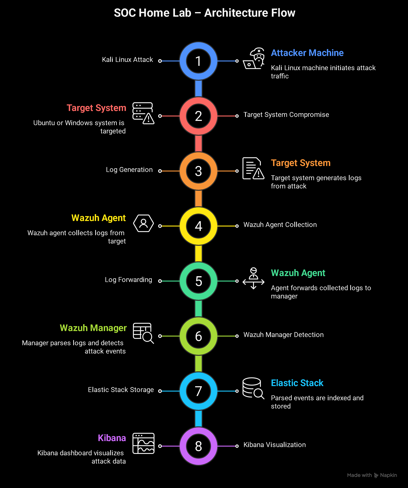

# SOC Home Lab

## Table of Contents
1. [Project Overview](#1-project-overview)
2. [Lab Objectives](#2-lab-objectives)
3. [Lab Architecture](#3-lab-architecture)
4. [Network Configuration](#4-network-configuration)
5. [Lab Environment Configuration](#5-lab-environment-configuration)
6. [Server Hardening & Initial Setup](#6-server-hardening--initial-setup)
7. [Wazuh SIEM Installation & Configuration](#7-wazuh-siem-installation--configuration)
8. [Agent Deployment & Log Onboarding](#8-agent-deployment--log-onboarding)


## 1. Project Overview

This repository documents the design and implementation of a personal Security Operations Center (SOC) home lab built to simulate real-world blue team monitoring and detection workflows.

The primary goal of this project is to gain hands-on experience with log analysis, threat detection, and incident investigation by deploying a SIEM platform and a network intrusion detection system inside an isolated virtualized environment.

The lab is intentionally designed to run on limited hardware (8GB RAM, dual-core CPU), requiring careful resource allocation and architectural decisions to maintain performance while preserving realism.

Through this project, I aim to:

* Build practical experience with SIEM and IDS deployment
* Generate and analyze security events in a controlled lab
* Simulate attacker techniques and observe detection behavior
* Understand how alerts map to real-world attack patterns

This project is structured and documented incrementally to reflect a real SOC deployment lifecycle — from infrastructure setup to detection engineering and incident response analysis.

---

## 2. Lab Objectives

The lab is designed to replicate core functions of a basic Security Operations Center within a controlled virtual environment.

The key objectives of this setup are:

* Deploy a centralized Ubuntu Server to function as the SOC node
* Install and configure a SIEM platform for log aggregation and analysis
* Integrate a network-based intrusion detection system (IDS)
* Simulate attacker activity from a separate machine within an isolated network
* Generate, capture, and investigate security alerts
* Analyze detection logic and correlate events
* Document findings in a structured and professional format

The long-term goal is to build practical blue team experience by moving beyond theoretical concepts into hands-on monitoring and incident analysis.

---

## 3. Lab Architecture

The SOC lab is deployed using a virtualized environment to simulate a controlled internal network. The architecture separates monitoring, analysis, and attack simulation components to reflect a simplified real-world SOC structure.

The environment consists of:

| Component / Tool               | Role in the Lab                                             |
| ------------------------------ | ----------------------------------------------------------- |
| **Host Machine (VMware)**      | Runs and manages all virtual machines                       |
| **Ubuntu Server (SOC Node)**   | Centralized log collection, analysis, and monitoring server |
| **Kali Linux (Attacker Node)** | Simulates offensive security activity and attack scenarios  |
| **NAT Virtual Network**        | Provides an isolated internal subnet with internet access   |
| **Wazuh**                      | SIEM platform for threat detection and alert generation     |
| **Elastic Stack**              | Log indexing, storage, and visualization backend            |


The Ubuntu Server acts as the core SOC system where SIEM and IDS components will be installed. All simulated attack traffic generated from the attacker machine will traverse the isolated virtual network and be monitored by the SOC node.



This architecture ensures:

* Safe experimentation without affecting the external network
* Controlled attack simulation
* Clear separation of roles (attacker vs defender)
* Realistic detection workflow

## 4. Network Configuration

All virtual machines in this SOC Home Lab are configured to use **NAT networking mode** within the hypervisor. This ensures that each VM resides within the same internal virtual subnet while still having internet access through the host machine.

For this lab, the internal subnet is configured as:


This means:
* All VMs receive IP addresses within the range 192.168.1.1 – 192.168.1.254
* The subnet mask is 255.255.255.0
* The VMs can communicate directly with each other
* External internet access is routed through the host system

Using a shared subnet is critical for a SOC lab environment to ensure:

* The attacker machine (**Kali Linux**) must be able to reach the target systems
* The target machines must forward logs to the SIEM server
* The SIEM components (**Wazuh** + **Elastic Stack**) must communicate internally

This configuration simulates a small enterprise internal LAN environment, making it ideal for attack simulation, log collection, and detection testing.

## 5. Lab Environment Configuration

### Host Virtualization Platform

The SOC Home Lab is deployed using **VMware Workstation** as the hypervisor. VMware provides stable networking controls and resource allocation, making it suitable for simulating a small enterprise lab environment.

### Operating System

The primary server for this lab runs:

**Ubuntu 22.04.5 LTS Server**

Ubuntu Server was selected due to:

* Long-Term Support (LTS) stability
* Wide compatibility with security tools
* Lightweight footprint suitable for SIEM deployments
* Strong community and enterprise adoption

---

### Virtual Machine Specifications

The Ubuntu Server VM is configured with the following resources:

| Resource | Allocation   |
| -------- | ------------ |
| RAM      | 4 GB         |
| CPU      | 2 cores      |
| Disk     | 40 GB        |
| Network  | VMnet8 (NAT) |


### Disk Allocation (While Server Installation)

Confirmation of the allocated disk space during Ubuntu Server installation.


### SSH Installation Verification (While Server Installation)

OpenSSH Server was enabled during installation to allow secure remote access to the Ubuntu Server VM.


### System Verification (After Proper Installation)

This screenshot verifies the Ubuntu version, hostname, and IP configuration, confirming the server is correctly installed and connected to the NAT subnet.


---

### 6. Server Hardening & Initial Setup

Before deploying security monitoring tools, it is critical to ensure that the underlying server is properly hardened. A misconfigured SOC server can become a security risk itself.

This section focuses on patching, securing remote access, and validating system resources before installing SIEM components.

#### 6.1 System Update & Upgrade

**Purpose:** Ensure the OS is fully patched and protected.

**Commands run:**

```bash
sudo apt update && sudo apt upgrade -y
```

**Screenshot:** Shows successful completion of updates.


---

#### 6.2 6.2 SSH Service Verification

**Purpose:** Verify OpenSSH service is running securely and root login is disabled.

**Command run:**

```bash
sudo systemctl status ssh
```

**Screenshot:** Confirms SSH service is active and running.


---

#### 6.3 Firewall Setup (UFW)

**Purpose:** Limit access to only necessary ports and services.

**Commands run:**

```bash
sudo ufw allow ssh
sudo ufw enable
sudo ufw status
```

**Screenshot:** Shows UFW enabled and rules applied.


---

#### 6.4 Disk & Resource Verification

**Purpose:** Confirm VM resources match the planned lab setup.

**Commands run:**

```bash
df -h          # Disk usage
free -h        # RAM usage
lscpu          # CPU info
```

**Screenshot:** Shows proper disk, RAM, and CPU allocation.


---

#### 6.5 Summary

At this stage, the Ubuntu Server is hardened, updated, and validated. The environment is now prepared for SIEM and IDS deployment in the next phase of the SOC build.

---


# 7. Wazuh SIEM Installation & Configuration

This section documents the deployment of the Wazuh all-in-one SIEM stack on the Ubuntu Server SOC node. The installation includes the Wazuh Manager, Wazuh Indexer (OpenSearch), Filebeat, and the Wazuh Dashboard.

The all-in-one deployment model was selected to optimize resource usage within the lab’s 4GB RAM environment while maintaining full SIEM functionality.

---

## 7.1 Installation Script Download

The official Wazuh installation script was downloaded directly from the Wazuh package repository.

**Command used:**

```bash
curl -O https://packages.wazuh.com/4.14/wazuh-install.sh
```

This script automates the deployment of all required Wazuh components.


---

## 7.2 Executing the All-in-One Installation

The script was made executable and run in all-in-one mode:

```bash
chmod +x wazuh-install.sh
sudo ./wazuh-install.sh -a
```

The installation process:

* Installed required dependencies
* Deployed Wazuh Manager
* Installed and configured OpenSearch
* Installed Filebeat
* Configured Wazuh Dashboard


---

## 7.3 Dashboard Credential Generation

Upon successful installation, the script generated default dashboard credentials required for web access.

These credentials allow authentication to the Wazuh Dashboard.


---

## 7.4 Service Verification

After installation, all Wazuh services were verified to ensure they were active and running.

**Commands used:**

```bash
sudo systemctl status wazuh-manager
sudo systemctl status wazuh-dashboard
sudo systemctl status wazuh-indexer
sudo systemctl status filebeat
```

All services returned:

```
active (running)
```


---

## 7.5 Firewall Configuration (Port 443)

Since UFW was previously enabled during server hardening, HTTPS traffic had to be explicitly allowed for dashboard access.

**Command used:**

```bash
sudo ufw allow 443/tcp
```

This ensures secure browser-based access to the Wazuh Dashboard.


---

## 7.6 Dashboard Access & Verification

The Wazuh Dashboard was accessed from the host machine using:

```
https://192.168.1.136
```

Because the installation uses a self-signed certificate, the browser displayed a security warning, which was bypassed for lab purposes.

Successful login confirmed:

* Wazuh services are operational
* OpenSearch indexing is functioning
* Dashboard is properly connected to the manager

### Login Page


### Dashboard Home


---

## 7.7 Summary

At this stage, the Wazuh SIEM stack is fully deployed and operational within the SOC lab environment.

The Ubuntu Server now functions as:

* Centralized log collection server
* Detection engine
* Alerting platform
* Visualization dashboard

The environment is now prepared for endpoint agent deployment and attack simulation testing in the next phase.

---

# 8. Agent Deployment & Log Onboarding

With the Wazuh SIEM stack operational on the Ubuntu SOC node, the next phase is onboarding an endpoint into the monitoring environment.

Kali Linux will act as a monitored endpoint, sending logs to the SIEM. This mirrors real SOC workflows where endpoints must be enrolled before detection and analysis.

---

## 8.1 Kali Linux VM Configuration

VM configuration optimized for 8GB host:

| Resource | Allocation   |
| -------- | ------------ |
| RAM      | 2 GB         |
| CPU      | 2 cores      |
| Disk     | 30 GB        |
| Network  | VMnet8 (NAT) |


---

## 8.2 Network Verification

Verify Kali IP:

```bash
ip a
```

Ping the Wazuh Manager:

```bash
ping 192.168.1.136
```


---

## 8.3 Installing the Wazuh Agent

Add GPG key:

```bash
curl -s https://packages.wazuh.com/key/GPG-KEY-WAZUH | sudo gpg --dearmor -o /usr/share/keyrings/wazuh.gpg
```


Add repository:

```bash
echo "deb [signed-by=/usr/share/keyrings/wazuh.gpg] https://packages.wazuh.com/4.x/apt stable main" | sudo tee /etc/apt/sources.list.d/wazuh.list
```


Update & install agent:

```bash
sudo apt update
sudo WAZUH_MANAGER='192.168.1.136' apt install wazuh-agent -y
```


Enable and start agent:

```bash
sudo systemctl enable wazuh-agent
sudo systemctl start wazuh-agent
sudo systemctl status wazuh-agent
```


---

## 8.4 Secure Agent Registration (Key-Based)

On Ubuntu manager, add Kali agent:

```bash
sudo /var/ossec/bin/manage_agents
```


Extract agent key:


Import key on Kali using the same utility and restart the agent. Verify on manager:

```bash
sudo /var/ossec/bin/agent_control -l
```


---

## 8.5 Firewall Considerations

If the agent cannot connect, ensure ports are allowed on the manager:

```bash
sudo ufw allow 1514
sudo ufw allow 1515
```


---

## 8.6 Dashboard Verification

Access the Wazuh Dashboard:

```
https://192.168.1.136
```

Under **Wazuh → Agents**, verify `kali-linux`:

* Status: Active
* OS correctly identified
* Keepalive signals received


---

## 8.7 Log Generation & Event Validation

Generate events on Kali:

**Authentication attempts:**

```bash
sudo su -
sudo su invaliduser
```


**Package installation:**

```bash
sudo apt install sl -y
```


**Events visible in Dashboard (Security Events filtered by `kali-linux`):**


---

## 8.8 Summary

Kali endpoint is now:

* Installed with Wazuh agent
* Securely registered and active
* Sending real-time logs to the SIEM

The SOC lab is fully operational for attack simulation and monitoring.

---


